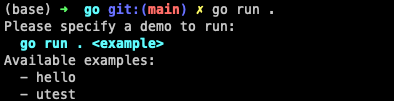

# Go - But where?

Playground for the Go(land) language.

### Run

```console
go run . <example>
```

If you just type `go run .`, you will see all available examples:



### Available examples

#### hello
> [!NOTE]
> Shows how to query console input and deal with time in Go.

Asks for your name and prints it on the console with a date time stamp:

```bash
> go run . hello
Please enter your name [golander]: _
```

#### utest
> [!NOTE]
> Shows how to implement unit tests in Go.

Demonstrates how unit tests work in Go.
